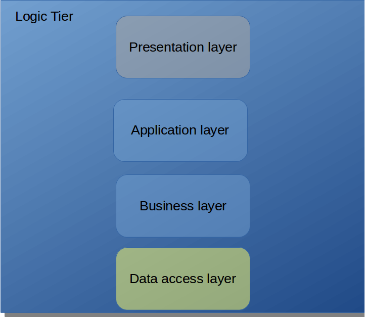
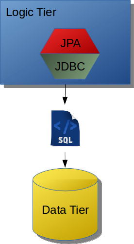
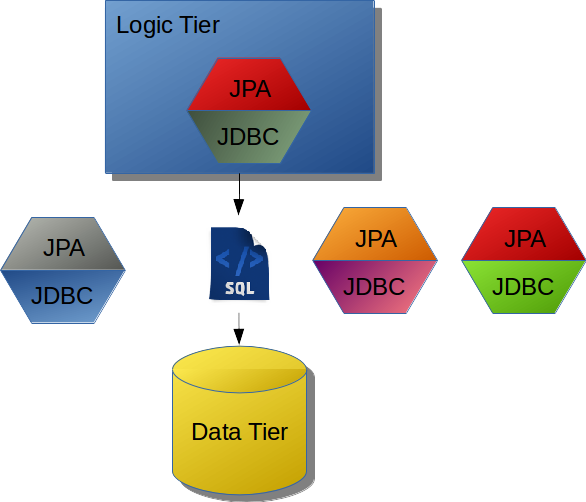
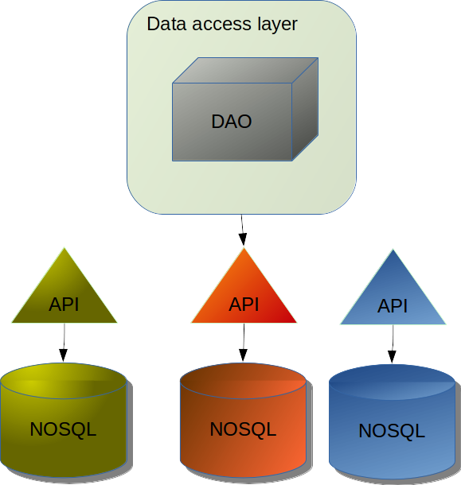
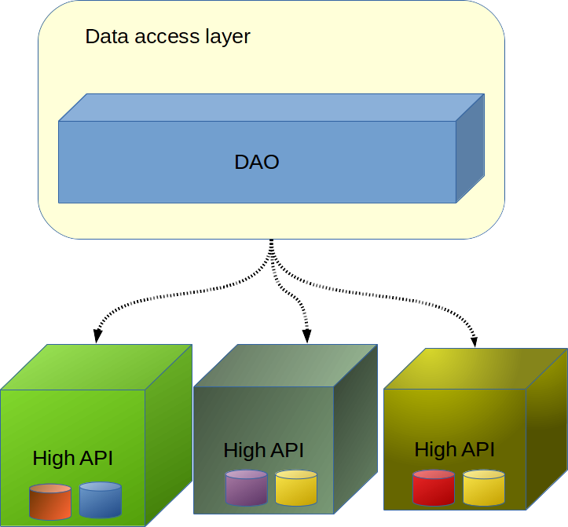
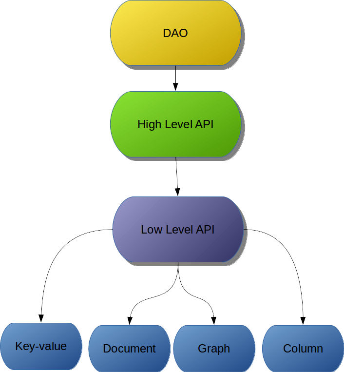
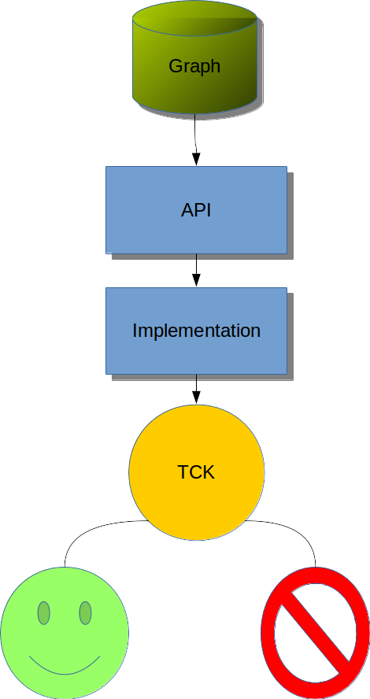
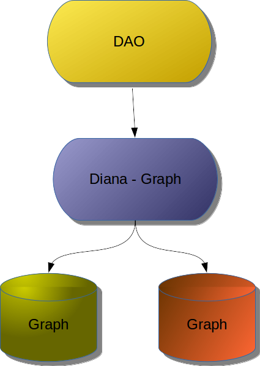

## The main idea behind the API

   Once, we talked about the importance about the standard of a NoSQL database API, the next step is discuss, in more details, about API. However, to make an easy explanation, first gonna talk about both layer and tier. These structures level make the communication, maintenance, split the responsibility clearer. The new API proposal gonna be responsible to be bridge between the logic tier and data tier, to do this, we need to create two APIs one to communication to a database and another one to be a high abstraction to Java application.

### Tier, a physical structure in software

  In a software world is really common that application has structures: tier, a physical structure, and layer, logic one. The multi-tier application has basically three tiers:

* **Presentation** 	tier: That has as main duty translate the result, from below tiers, to user can understand.	
* **Logic tier:** The tier where has all business rules, process, conditions, save 	informations, etc. This tier moves and processes an information between other tiers.
* **Data tier:** Storage and retrieve information either database or a system file.

### Layer, the logic structure in a software

 
 
   
   Talking precisely in a logic tier, to split responsibility, there are layers. These layer have an overpass through presentation and data tier besides the business rules. Wherever the architecture structure chosen (MVC, HMVC, PAC, MVA, MVP, MVVM) they have basically four layers:

* **Application layer:** Bridge between presentation tier and logic tier, this layer, for example, transforms an object to JSON.
* **Service layer:** The functional layer that make business layers available. Grouping services into functional layers reduces the impact of change. Most 	changes affect only the layer in which they're made, with few side-effects that impact other layers. 	
* **Business layer:** Where that has business rules and models.
Persistence layer: Layer that access a data, the data tier.

###	Persistence layer in relational database

  
  Within a persistence layer, it has its own layers: A Data Access Object, DAO, this structure connect business layer and persistence layer. Inside it has an API that does database. Currently there is difference between SQL and NoSQL database:

In relational database there is two mechanisms, beyond DAO, JDBC and JPA:

* **JDBC:** A low layer with database that has communications, basic transactions, 	basically it's a driver to a specific database.	
* **JPA:** A high layer that has communication either JDBC and JPA. This layer has 	high abstraction to Java, this place has annotations and an EntityManager. In general a JPA has integration with other specifications such as CDI and bean validation.
	 	 	
  A huge advantage from this strategy that one change, either JDBC or JPA, can happen easily. When a developer changes a database, he just need change to a respective driver by database and done! code ready to a new database changed.
  
  
  
  

### Persistence layer in NoSQL database

  
  
  
  
  In a NoSQL database, there isn't strategy to save code or low impact in a change. All APIs are different and don't follow no one standard, so one change to a new database results in a lot of work. There are some solutions such as Spring Data, Hibernate OGM, TopLink NoSQL but it's in a high level, in other words, if this high level API hasn't support to a specific database the result gonna be either change a high level API or use the API from NoSQL database directly, so lost a lot of code. This solution have several issues:

* The database vendor need to be worried about the high level abstraction to Java world
* The solution vendor needs to be worried about the low level of communication with specific database.
* The database vendor needs to “copy” this communication solutions to all Java vendors.
* To a Java developer there are two lock-in types: If a developer uses an API directly in a change it will lost code, if a developer uses  a high level abstraction, this developer has lock-in in a Java solution because if  this high level hasn't support to a specific NoSQL database, the developer need to change to either Java solution or use an API NoSQL directly.

### The solution

The solve this problem the API should have two layers:

* The communication layer: the driver from specific database that connects Java to an exactly database. This layer has four specialization, one to each NoSQL type.
* The abstraction level: its duty is to high abstraction to Java developers, this layer has annotations and integration to other specializations.

So:

* The database vendor just need to be worried with a Java communication.
* The Java solution vendor, just need to be worried with a high abstraction level.

These APIs are optionals each other, in other words, a Java solution just need to implement a high solution and the database vendors need to implements the connection API.

### Diana Project was born

   The Diana project has as goal just be the low layer, in other words, just the communication layer to NoSQL database. Basically this project gonna work as a database driver. Diana will have four APIs, one for each database type, and its TCK respective. The test compatibility kit affirms if a driver implements an API correctively. So a X database of key-value implements and run all tests correctively that means this X database has support to key-value Diana API. 

The main reason to Diana just works in communication layer are:

* A developer doesn't want learn a new API beyond JPA.
* The abstraction layer makes sense as a JPA extension and not a new one.
* Be a communication API is good enough to be a project.

Furthermore Diana **will not** be:

* A new API to replace JPA
* A new API to abstraction layer
* Just one API communication to solve all kind of NoSQL database
* Be responsible to do integrations with other technologies such as CDI, EJB, Bean Validation, Spring, etc.

 So, even Diana not been a abstraction layer, this structure will make the existents ones, abstraction layer, do its job easier, because once they support Diana they will have support to all database that implements the API. Additionally Diana isn't valuable to use  just with a high API, if a Java Developer use Diana and DAO directly the change to another data provider will easier and clear.
 
 
 

