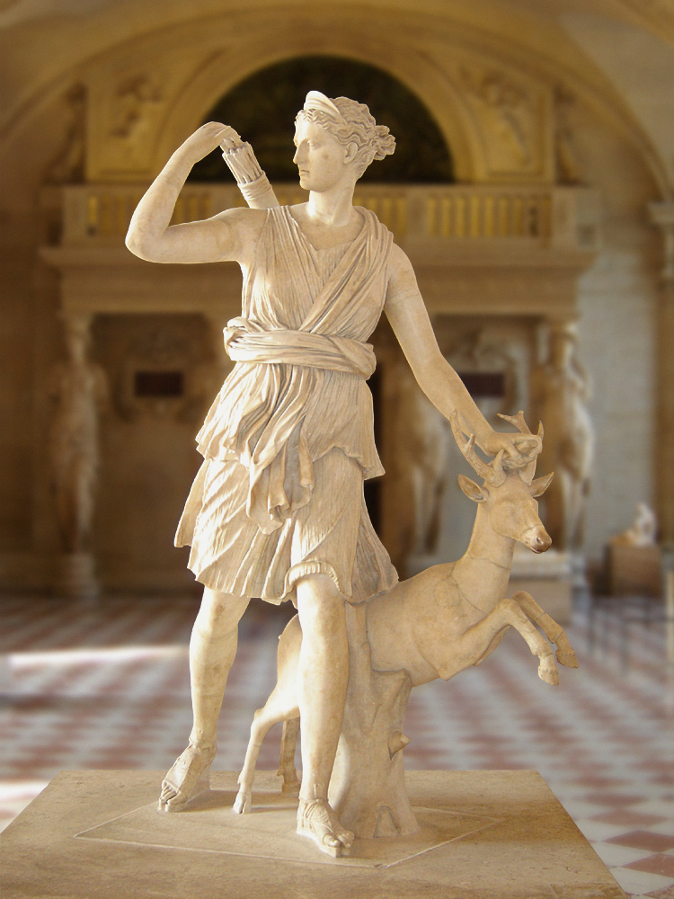

### Why Diana?

  In Roman mythology, Diana was the goddess of the hunt, the moon and nature being associated with wild animals and woodland, and having the power to talk to and control animals. She was eventually equated with the Greek goddess Artemis, though she had an independent origin in Italy. Diana was worshipped in ancient Roman religion and is revered in Roman Neopaganism and Stregheria. Diana was known to be the virgin goddess of childbirth and women. She was one of the three maiden goddesses — along with Minerva and Vesta — who swore never to marry.

Oak groves were especially sacred to her. According to mythology (in common with the Greek religion and their deity Artemis), Diana was born with her twin brother Apollo on the island of Delos, daughter of Jupiter and Latona. Diana made up a triad with two other Roman deities: Egeria the water nymph, her servant and assistant midwife; and Virbius, the woodland god.